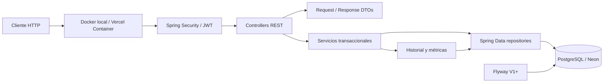
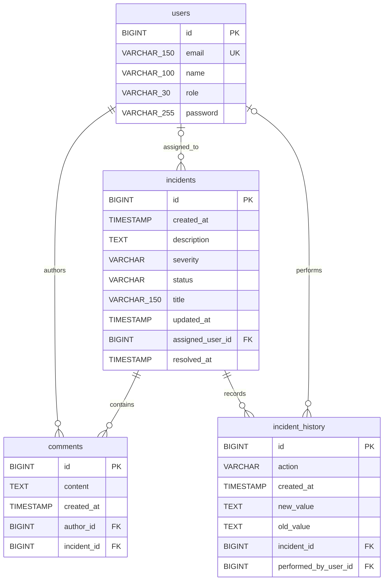

# IncidentOps

IncidentOps es una API REST para gestionar el ciclo de vida de incidentes operativos. El proyecto reúne autenticación JWT, autorización por roles, filtros y paginación, historial auditable, métricas, migraciones versionadas y un entorno reproducible con Docker Compose.

Está pensado como backend de portfolio y como base técnica para una herramienta interna de operaciones: separa transporte HTTP, reglas de negocio y persistencia, no expone entidades JPA directamente y mantiene PostgreSQL como fuente de verdad del esquema mediante Flyway.

Producción: [https://incidentops.vercel.app](https://incidentops.vercel.app), ejecutada como contenedor HTTP en Vercel con Neon PostgreSQL como almacenamiento persistente externo.

## Funcionalidades

- Registro e inicio de sesión con JWT.
- Roles `ADMIN`, `RESPONDER` y `VIEWER`.
- Creación, consulta, búsqueda, filtrado y paginación de incidentes.
- Flujo de estados controlado: `OPEN` → `INVESTIGATING` → `IDENTIFIED` → `MONITORING` → `RESOLVED`.
- Severidades `SEV1`, `SEV2`, `SEV3` y `SEV4`.
- Asignación de incidentes a usuarios.
- Comentarios e historial de cambios con autor identificado.
- Métricas agregadas por estado y severidad.
- Manejo consistente de validaciones, recursos inexistentes y conflictos.
- OpenAPI/Swagger en desarrollo y deshabilitado en producción.
- Bootstrap administrativo opcional y seguro para una instalación nueva.
- PostgreSQL 18.6, Flyway y validación del modelo Hibernate.
- Imagen multi-stage y ejecución no privilegiada en Docker.
- Landing pública mínima sin información operativa sensible.
- CORS restringido al origen configurado mediante `FRONTEND_URL`.
- Suite automatizada de 70 pruebas.

## Stack

| Área | Tecnología |
|---|---|
| Lenguaje | Java 25 |
| Framework | Spring Boot 4.1.1 |
| Web | Spring MVC |
| Persistencia | Spring Data JPA + Hibernate |
| Base de datos | PostgreSQL 18.6 local / Neon PostgreSQL en producción |
| Migraciones | Flyway |
| Seguridad | Spring Security, OAuth2 Resource Server y JWT |
| Documentación | SpringDoc OpenAPI 3.1.1 |
| Testing | JUnit Platform, Mockito, Spring Boot Test, MockMvc y H2 |
| Build | Maven Wrapper / Maven 3.9.16 |
| Contenedores | Docker, Docker Compose y Vercel Containers |
| Producción | Vercel + Neon PostgreSQL |

## Arquitectura



Responsabilidades principales:

- `controller`: contrato HTTP, validación de entrada y códigos de respuesta.
- `service`: reglas de negocio, transacciones y transformación a DTO.
- `repository`: consultas JPA, búsquedas y agregaciones.
- `model`: entidades y enums del dominio.
- `dto`: modelos explícitos de entrada y salida.
- `exception`: traducción centralizada de errores a respuestas HTTP.
- `config`: seguridad, OpenAPI, BCrypt, JWT y bootstrap opcional.

La opción `spring.jpa.open-in-view=false` obliga a resolver relaciones dentro de los límites transaccionales. Los repositorios usan `EntityGraph` en las lecturas que necesitan relaciones lazy para construir DTOs.

## Modelo de datos



Las claves primarias son `BIGINT GENERATED BY DEFAULT AS IDENTITY`. El correo es único; los enums están protegidos por restricciones `CHECK`; y las relaciones usan claves foráneas reales. Flyway registra sus ejecuciones por separado en `flyway_schema_history`.

## Seguridad y roles

Los tokens se envían así:

```http
Authorization: Bearer <JWT>
```

| Operación | ADMIN | RESPONDER | VIEWER |
|---|:---:|:---:|:---:|
| Consultar incidentes, métricas, comentarios e historial | Sí | Sí | Sí |
| Crear o modificar incidentes | Sí | Sí | No |
| Agregar comentarios | Sí | Sí | No |
| Eliminar incidentes | Sí | No | No |
| Listar usuarios | Sí | Sí | No |
| Crear o modificar usuarios | Sí | No | No |

`GET /` ofrece una landing pública mínima que indica que IncidentOps API está activa. `/api/auth/register` y `/api/auth/login` también son públicos; el resto de la API conserva sus reglas de seguridad y su comportamiento normal. El registro público siempre crea un usuario `VIEWER`; no acepta un rol enviado por el cliente. Las contraseñas se almacenan con BCrypt y el secreto JWT se obtiene exclusivamente del entorno.

CORS permite un único origen exacto configurado mediante `FRONTEND_URL`; no utiliza wildcard. Esta política controla el acceso desde navegadores, mientras Spring Security continúa aplicando autenticación y roles a todos los recursos protegidos.

## Bootstrap administrativo opcional

Una base nueva no contiene credenciales predeterminadas. Para crear el primer administrador se pueden definir temporalmente:

```dotenv
BOOTSTRAP_ADMIN_EMAIL=
BOOTSTRAP_ADMIN_PASSWORD=
```

El bootstrap:

- queda desactivado si cualquiera de las dos variables falta o está vacía;
- se ejecuta durante el arranque mediante `ApplicationRunner`;
- crea exactamente un usuario con rol `ADMIN` solo si `users` está vacía;
- codifica la contraseña con el `PasswordEncoder` BCrypt de la aplicación;
- no registra la contraseña ni reemplaza usuarios;
- no vuelve a crear un administrador en reinicios posteriores.

Después del primer arranque correcto, retire ambas variables del entorno. Mantenerlas no permite cambiar roles ni sobrescribir cuentas, pero retirarlas reduce la exposición accidental. El registro público continúa creando únicamente `VIEWER`.

La base de producción ya fue inicializada. Las variables de bootstrap fueron retiradas de Vercel y no forman parte de la configuración permanente.

## Puesta en marcha con Docker

Requisitos: Docker Engine o Docker Desktop con Compose v2.

1. Cree su archivo local de configuración:

   ```powershell
   Copy-Item .env
   ```

2. Reemplace los placeholders de `POSTGRES_PASSWORD` y `JWT_SECRET`. Para una instalación completamente nueva, complete también las dos variables opcionales del bootstrap.

   Un secreto JWT Base64 de 256 bits puede generarse en PowerShell sin imprimirlo en archivos del repositorio:

   ```powershell
   $bytes = New-Object byte[] 32
   [Security.Cryptography.RandomNumberGenerator]::Create().GetBytes($bytes)
   [Convert]::ToBase64String($bytes)
   ```

3. Valide y levante el stack:

   ```powershell
   docker compose config --quiet
   docker compose up --build -d
   docker compose ps
   ```

4. Consulte los logs si necesita diagnosticar el arranque:

   ```powershell
   docker compose logs -f backend
   ```

5. Detenga los contenedores conservando los datos:

   ```powershell
   docker compose down
   ```

No use `docker compose down -v` salvo que quiera borrar deliberadamente el volumen local de PostgreSQL. PostgreSQL no publica su puerto al host; el backend se conecta internamente a `postgres:5432` y expone la API en `http://localhost:8080`.

## Deployment en Vercel

Vercel construye [Dockerfile.vercel](Dockerfile.vercel) como un único contenedor HTTP. La imagen usa un build multi-stage con Java 25 y ejecuta el JAR Spring Boot como usuario no-root. PostgreSQL no vive dentro del contenedor: producción utiliza Neon mediante las variables JDBC del entorno.

Spring escucha el puerto asignado por la plataforma:

```properties
server.port=${PORT:8080}
```

`PORT` es administrado por Vercel; el fallback `8080` conserva el comportamiento local. La configuración permanente del proyecto en Vercel requiere:

```text
SPRING_PROFILES_ACTIVE
SPRING_DATASOURCE_URL
SPRING_DATASOURCE_USERNAME
SPRING_DATASOURCE_PASSWORD
JWT_SECRET
FRONTEND_URL
```

`FRONTEND_URL` debe contener el origen público exacto del frontend, sin wildcard. `BOOTSTRAP_ADMIN_EMAIL` y `BOOTSTRAP_ADMIN_PASSWORD` no son permanentes: solo se usan juntas para inicializar una base vacía y después se retiran.

## Ejecución local sin Docker para el backend

Se necesita Java 25 y una instancia PostgreSQL accesible. Configure el entorno antes de usar el wrapper:

```powershell
$env:SPRING_PROFILES_ACTIVE = "dev"
$env:SPRING_DATASOURCE_URL = "jdbc:postgresql://localhost:5432/incidentops"
$env:SPRING_DATASOURCE_USERNAME = "<database-user>"
$env:SPRING_DATASOURCE_PASSWORD = "<database-password>"
$env:JWT_SECRET = "<base64-encoded-256-bit-secret>"
$env:FRONTEND_URL = "http://localhost:5173"
.\mvnw.cmd spring-boot:run
```

El perfil `dev` habilita Swagger y SQL de diagnóstico. El perfil `prod` deshabilita Swagger, `/v3/api-docs` y el log SQL:

```powershell
$env:SPRING_PROFILES_ACTIVE = "prod"
```

## Variables de entorno

| Variable | Requerida | Uso |
|---|:---:|---|
| `POSTGRES_DB` | Docker | Nombre de la base; por defecto `incidentops` en Compose. |
| `POSTGRES_USER` | Docker | Usuario de PostgreSQL; por defecto `incidentops` en Compose. |
| `POSTGRES_PASSWORD` | Sí en Docker | Contraseña local de PostgreSQL; no tiene valor por defecto. |
| `SPRING_DATASOURCE_URL` | Sí fuera de Compose | URL JDBC de PostgreSQL. |
| `SPRING_DATASOURCE_USERNAME` | Sí fuera de Compose | Usuario JDBC. |
| `SPRING_DATASOURCE_PASSWORD` | Sí fuera de Compose | Contraseña JDBC. |
| `JWT_SECRET` | Sí | Secreto Base64 con al menos 256 bits decodificados. |
| `FRONTEND_URL` | Sí en producción | Origen exacto autorizado por CORS; localmente usa `http://localhost:5173` por defecto. |
| `PORT` | Administrada | Puerto HTTP asignado por Vercel; localmente usa `8080` por defecto. |
| `BOOTSTRAP_ADMIN_EMAIL` | Temporal | Correo del primer ADMIN; vacío desactiva el bootstrap. |
| `BOOTSTRAP_ADMIN_PASSWORD` | Temporal | Contraseña del primer ADMIN; debe retirarse después de inicializar una base vacía. |
| `FLYWAY_BASELINE_ON_MIGRATE` | No | `false` por defecto; solo para incorporar conscientemente un esquema preexistente. |
| `SPRING_PROFILES_ACTIVE` | Sí en producción | `dev` o `prod`; Compose usa `dev` y Vercel usa `prod`. |

No confirme `.env`, tokens, contraseñas ni secretos. El repositorio solo conserva `.env` con placeholders.

## Flyway y esquemas existentes

En una base vacía, Flyway ejecuta `V1__baseline_schema.sql` y crea `users`, `incidents`, `comments` e `incident_history`. Hibernate usa `ddl-auto=validate`: valida el resultado, pero no lo altera.

En una base preexistente que coincide exactamente con V1, el primer baseline es una operación administrativa explícita:

1. Respaldar la base.
2. Verificar que el esquema coincide con V1.
3. Ejecutar una sola vez con `FLYWAY_BASELINE_ON_MIGRATE=true`.
4. Confirmar la fila baseline versión 1 en `flyway_schema_history`.
5. Volver a `FLYWAY_BASELINE_ON_MIGRATE=false`.

No active baseline automáticamente para una base nueva. Las migraciones futuras deben añadirse como `V2__...sql`, `V3__...sql`, etc.; nunca se edita una migración ya aplicada.

## Documentación de la API

Con el perfil `dev`:

- Swagger UI: `http://localhost:8080/swagger-ui/index.html`
- OpenAPI JSON: `http://localhost:8080/v3/api-docs`

En `prod` ambos recursos están deshabilitados.

### Endpoints

| Método | Ruta | Descripción | Acceso |
|---|---|---|---|
| `GET` | `/` | Landing mínima de disponibilidad | Público |
| `POST` | `/api/auth/register` | Registra un `VIEWER` y devuelve JWT | Público |
| `POST` | `/api/auth/login` | Autentica y devuelve JWT | Público |
| `GET` | `/api/incidents` | Busca, filtra, ordena y pagina | Todos los roles |
| `POST` | `/api/incidents` | Crea un incidente `OPEN` | ADMIN, RESPONDER |
| `GET` | `/api/incidents/{id}` | Obtiene un incidente | Todos los roles |
| `PATCH` | `/api/incidents/{id}/status?status=...` | Avanza el estado | ADMIN, RESPONDER |
| `PATCH` | `/api/incidents/{id}/severity?severity=...` | Cambia severidad | ADMIN, RESPONDER |
| `PATCH` | `/api/incidents/{incidentId}/assignee/{userId}` | Asigna usuario | ADMIN, RESPONDER |
| `DELETE` | `/api/incidents/{id}` | Elimina incidente | ADMIN |
| `GET` | `/api/incidents/metrics` | Devuelve métricas agregadas | Todos los roles |
| `GET` | `/api/incidents/{incidentId}/comments` | Lista comentarios | Todos los roles |
| `POST` | `/api/incidents/{incidentId}/comments` | Agrega comentario | ADMIN, RESPONDER |
| `GET` | `/api/incidents/{incidentId}/history` | Consulta historial | Todos los roles |
| `GET` | `/api/users` | Lista usuarios | ADMIN, RESPONDER |
| `POST` | `/api/users` | Crea un registro de usuario | ADMIN |
| `PATCH` | `/api/users/{id}` | Actualiza nombre, correo y rol | ADMIN |

La búsqueda de incidentes acepta `status`, `severity`, `assigneeId`, `search`, `page`, `size` y `sort`. El tamaño máximo de página es 100 y las propiedades de orden permitidas son `id`, `title`, `status`, `severity`, `createdAt`, `updatedAt` y `resolvedAt`.

### Ejemplos

Registrar un usuario público:

```bash
curl -X POST http://localhost:8080/api/auth/register \
  -H "Content-Type: application/json" \
  -d '{"name":"Operations Viewer","email":"viewer@example.test","password":"<strong-password>"}'
```

Iniciar sesión:

```bash
curl -X POST http://localhost:8080/api/auth/login \
  -H "Content-Type: application/json" \
  -d '{"email":"admin@example.test","password":"<admin-password>"}'
```

Crear un incidente con un token `ADMIN` o `RESPONDER`:

```bash
curl -X POST http://localhost:8080/api/incidents \
  -H "Authorization: Bearer <JWT>" \
  -H "Content-Type: application/json" \
  -d '{"title":"Payments unavailable","description":"Checkout requests are timing out","severity":"SEV1"}'
```

Buscar y paginar:

```bash
curl "http://localhost:8080/api/incidents?status=OPEN&severity=SEV1&search=payment&page=0&size=10&sort=createdAt,desc" \
  -H "Authorization: Bearer <JWT>"
```

Avanzar el estado y agregar un comentario:

```bash
curl -X PATCH "http://localhost:8080/api/incidents/1/status?status=INVESTIGATING" \
  -H "Authorization: Bearer <JWT>"

curl -X POST http://localhost:8080/api/incidents/1/comments \
  -H "Authorization: Bearer <JWT>" \
  -H "Content-Type: application/json" \
  -d '{"content":"Database latency is under investigation."}'
```

### Respuestas y errores

Los DTO de salida no incluyen contraseñas. Un error controlado tiene una forma semejante a:

```json
{
  "timestamp": "2026-09-30T19:30:00",
  "status": 404,
  "error": "Not Found",
  "message": "Incident not found with id: 999",
  "path": "/api/incidents/999"
}
```

Códigos principales:

- `200 OK`: lectura o actualización correcta.
- `201 Created`: registro, usuario, incidente o comentario creado.
- `204 No Content`: eliminación correcta.
- `400 Bad Request`: validación, JSON, parámetros o transición de estado inválidos.
- `401 Unauthorized`: autenticación ausente o inválida.
- `403 Forbidden`: el rol no permite la operación.
- `404 Not Found`: recurso inexistente.
- `409 Conflict`: correo duplicado o restricción de integridad.
- `500 Internal Server Error`: error inesperado sin filtrar detalles internos.

## Testing

Ejecute toda la suite:

```powershell
.\mvnw.cmd clean test
```

Estado verificado: **70 tests, 0 failures, 0 errors, 0 skipped**.

La cobertura funcional incluye:

- servicios de incidentes, comentarios, historial, usuarios, autenticación y JWT;
- transiciones válidas e inválidas, filtros, búsqueda, paginación y métricas;
- autorización por método y rol mediante MockMvc;
- transacciones e historial integrado;
- migración Flyway V1 y búsquedas JPA sobre H2;
- configuración criptográfica JWT;
- bootstrap ADMIN, omisiones, BCrypt e idempotencia;
- CORS, landing pública y conservación de los límites de autorización.

## Estructura del proyecto

```text
src/main/java/com/djorka/incidentops/
├── config/       # Security, JWT, OpenAPI, BCrypt y AdminBootstrap
├── controller/   # API REST
├── dto/          # Contratos de entrada y salida
├── exception/    # Excepciones y handler global
├── model/        # Entidades y enums
├── repository/   # Spring Data JPA
├── service/      # Reglas de negocio y transacciones
└── IncidentopsApplication.java

src/main/resources/
├── db/migration/V1__baseline_schema.sql
├── static/index.html
├── application.properties
├── application-dev.properties
└── application-prod.properties

src/test/java/com/djorka/incidentops/
├── config/
├── controller/
├── repository/
└── service/
```

## Decisiones de diseño destacables

- DTOs en el borde HTTP para no serializar entidades ni credenciales.
- JWT stateless con roles contenidos como authorities.
- BCrypt centralizado en un `PasswordEncoder` compartido.
- Transacciones en operaciones que escriben el dominio y su historial.
- `EntityGraph` y DTO mapping transaccional con Open Session in View desactivado.
- Filtros combinables mediante JPA Specifications.
- Métricas calculadas en base de datos en una sola consulta agregada.
- Flyway como propietario del esquema y Hibernate limitado a validar.
- Perfiles para separar observabilidad de desarrollo y exposición de Swagger.
- Bootstrap inicial opt-in, idempotente y sin credenciales hardcodeadas.
- Contenedor runtime sin Maven y ejecutado con usuario no root.
- `Dockerfile.vercel` separado del stack local y PostgreSQL persistente alojado externamente en Neon.
- Puerto HTTP dinámico mediante `PORT` y CORS limitado a `FRONTEND_URL`.

## Limitaciones conocidas y próximos pasos

- `POST /api/users` crea un registro administrativo sin contraseña; una cuenta autenticable debe originarse mediante registro público y luego ser promovida por un ADMIN. Este contrato podría rediseñarse en una versión futura.
- Los comentarios, el historial y la lista de usuarios aún no están paginados.
- La representación JSON de `Page` depende actualmente del contrato de Spring Data; conviene estabilizarla con un DTO de página propio.
- No existe refresh token, revocación de tokens ni recuperación de contraseña.
- No hay rate limiting ni integración con un proveedor externo de identidad.
- El historial y los comentarios impiden borrar ciertos incidentes mediante sus claves foráneas; la API devuelve conflicto en lugar de perder trazabilidad.
- El build con Java 25 muestra avisos de compatibilidad futura de Lombok y de carga dinámica del agente Mockito. No son fallos actuales, pero deben revisarse al actualizar el JDK o las dependencias.
- Las imágenes de demostración pueden añadirse en `docs/images/` sin mezclar artefactos binarios con el código fuente.

## Portfolio

Este proyecto demuestra diseño de una API Spring Boot de extremo a extremo: modelado relacional, migraciones, seguridad stateless, autorización granular, validaciones, manejo de errores, pruebas unitarias y de integración, documentación OpenAPI y entrega reproducible con Docker, Vercel Containers y Neon PostgreSQL.

Para una demostración breve:

1. Abra la landing pública en `/`.
2. Para una demo local, arranque el stack con una base nueva y el bootstrap temporal.
3. Inicie sesión como ADMIN desde Swagger en el perfil `dev`.
4. Registre un VIEWER y muestre la diferencia de permisos.
5. Cree un incidente, avance su estado, cambie severidad y agregue un comentario.
6. Consulte historial, métricas, Flyway V1 y la suite verde de 69 pruebas.

## Licencia

Este proyecto se distribuye bajo la [MIT License](LICENSE).
